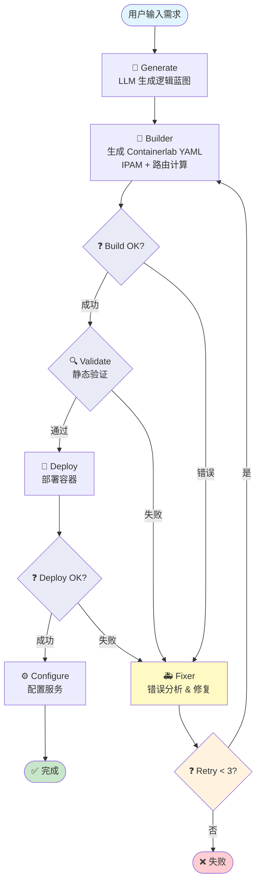

# Containerlab Builder

> 一个基于 LLM 和 LangGraph 的智能网络拓扑自动化构建工具

## 项目背景

网络安全研究和渗透测试经常需要搭建复杂的网络实验环境。传统的手动配置方式存在以下问题：

- **配置繁琐**：需要手动编写 YAML 配置文件、分配 IP 地址、配置路由
- **易出错**：人工配置容易产生 IP 冲突、路由错误等问题
- **效率低下**：重复性的搭建工作浪费大量时间

本项目通过 LLM 智能化地解决这些问题，让用户只需用自然语言描述需求，即可自动生成可部署的网络实验环境。

## 核心功能

### 1. 自然语言生成拓扑
用户只需用自然语言描述需求（如"创建一个有 DMZ 和内网的渗透测试实验室"），系统即可自动：
- 分析需求复杂度（simple/medium/complex）
- 设计逻辑网络拓扑
- 选择合适的 Docker 镜像
- 自动注入虚拟交换机

### 2. 智能 IP 地址管理 (IPAM)
- 自动为每个子网分配 CIDR 地址段
- 为节点自动分配接口 IP 地址
- 路由器节点优先分配低地址（.1, .2），终端节点分配高地址（.10+）

### 3. 自动路由配置
- **简单/中等复杂度**：自动计算并注入静态路由规则
- **复杂网络**：集成 FRR 路由套件，自动生成 OSPF 配置

### 4. 多层验证机制
- **静态验证**：YAML 生成前检查 IP 冲突、接口重复、网关可达性等问题
- **动态验证**：部署失败时自动分析错误日志并修复

### 5. 自动错误修复 (Fixer)
当部署或配置出现错误时，Fixer 节点会：
- 分析错误日志
- 诊断问题根因（镜像拉取失败、接口冲突等）
- 最小化修改设计方案
- 自动重试部署（最多 3 次）

## 工作流程



### 流程说明

| 节点 | 功能 | 输出 |
|------|------|------|
| **Generate** | LLM 分析需求，生成逻辑拓扑 | `NetworkBlueprint` |
| **Builder** | IPAM 分配、YAML 生成、路由计算 | `.clab.yml` 文件 |
| **Validate** | 检查 IP 冲突、接口重复、网关可达性 | 验证结果 |
| **Deploy** | 调用 containerlab 部署 | 容器运行状态 |
| **Configure** | 配置服务、验证连通性 | 配置日志 |
| **Fixer** | 错误诊断 + 最小化修复 | 更新后的 Blueprint |

### 错误处理机制

Fixer 会在以下三种情况下被触发：

1. **Build 错误** (`main.py:24-25`): Builder 生成 YAML 时产生 `error_logs`
2. **Validation 错误** (`main.py:27-28`): 静态验证失败
3. **Deploy 错误** (`main.py:30-36`): 容器部署失败 (`is_deployed=False` 或有 `error_logs`)

Fixer 执行后，如果重试次数 < 3 次，则返回 Builder 重新构建；否则流程失败。

## 支持的节点类型

| 类型 | 镜像示例 | 用途 |
|------|----------|------|
| 路由器 | alpine, frr | 连接不同子网，支持静态路由或 OSPF |
| 终端 | kali, ubuntu, redis | 作为攻击机、靶机或服务节点 |
| 交换机 | alpine (bridge) | 连接多个节点到同一 L2 网络 |

## 复杂度分级

| 级别 | 节点数 | 路由协议 | 适用场景 |
|------|--------|----------|----------|
| Simple | < 5 | 静态路由 | 简单两点间通信 |
| Medium | 5-15 | 静态路由 | 多层隔离网络（DMZ → 内网） |
| Complex | > 15 | OSPF/FRR | 企业级网状拓扑 |

## 快速开始

### 环境要求
- Python 3.10+
- Containerlab
- Docker
- OpenAI API Key（或其他兼容的 LLM API）

### 安装

```bash
# 克隆项目
git clone <repository-url>
cd containerlab_builder

# 安装依赖
pip install -r requirements.txt
```

### 配置

编辑 `config.py`，设置你的 LLM API 配置：

```python
LLM_MODEL = "gpt-4o"  # 或其他模型
BASE_URL = "https://api.openai.com/v1"
API_KEY = "your-api-key-here"
```

### 运行

```bash
python main.py
```

## 使用示例

```
用户输入：
"创建一个渗透测试实验室，包含：
- 外部区域：Kali 攻击机和边界路由器
- 内部区域：核心路由器、Log4j 漏洞靶机、Redis 服务器
- 确保攻击机能访问内网"

系统自动生成完整的 Containerlab 配置并部署
```

## 项目结构

```
containerlab_builder/
├── main.py           # LangGraph 工作流入口
├── state.py          # 全局状态定义
├── config.py         # 配置文件
├── node/
│   ├── generate.py   # LLM 生成逻辑蓝图
│   ├── builder.py    # YAML 构建器 (IPAM + 路由)
│   ├── validate.py   # 静态验证
│   ├── deploy.py     # Containerlab 部署
│   ├── configure.py  # 服务配置
│   ├── fixer.py      # 错误修复
│   └── utils.py      # Pydantic 模型定义
└── search_vuln_image.py  # 漏洞镜像搜索工具
```

## 技术栈

- **LangGraph**: 工作流编排
- **LangChain**: LLM 集成
- **Pydantic**: 数据验证
- **Containerlab**: 容器网络部署
- **FRR**: 动态路由协议 (OSPF)

## 许可证

MIT License
