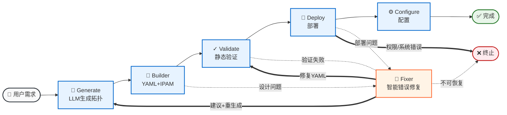

# 🏗️ Clab Builder

> 基于 LLM 和 LangGraph 的智能网络拓扑自动化构建工具

[](LICENSE)
[](https://www.python.org/downloads/)
[](https://github.com/psf/black)

## 功能状态

| 功能 | 状态 | 说明 |
| :--- | :--- | :--- |
| 场景 A - 单层网络 | ✅ 完整支持 | 基础测试场景，已通过全部测试用例 |
| 场景 B - 三层企业网络 | ✅ 完整支持 | 企业渗透测试场景，已通过全部测试用例 |
| 场景 C - 安全防护检测网络 | 🚧 实验性 | IPS/IDS 防护检测系统，开发中 |

## 项目背景

网络安全研究和渗透测试经常需要搭建复杂的网络实验环境。传统的手动配置方式存在以下问题：

- **配置繁琐**：需要手动编写 YAML 配置文件、分配 IP 地址、配置路由
- **易出错**：人工配置容易产生 IP 冲突、路由错误等问题
- **效率低下**：重复性的搭建工作浪费大量时间

本项目通过 LLM 智能化地解决这些问题，让用户只需用自然语言描述需求，即可自动生成可部署的网络实验环境。

## 核心功能

### 1. 自然语言生成拓扑

用户只需用自然语言描述需求（如"创建一个有 DMZ 和内网的渗透测试实验室"），系统即可自动：

- 分析需求复杂度（simple/medium/complex）
- 设计逻辑网络拓扑
- 选择合适的 Docker 镜像
- 自动注入虚拟交换机

### 2. 智能 IP 地址管理 (IPAM)

- 自动为每个子网分配 CIDR 地址段
- 为节点自动分配接口 IP 地址
- 路由器节点优先分配低地址（.1, .2），终端节点分配高地址（.10+）

### 3. 自动路由配置

- 集成 FRR 路由套件，自动生成 OSPF 配置
- 自动为路由器配置路由协议，实现跨子网通信

### 4. 多层验证机制

- **静态验证**：YAML 生成前检查 IP 冲突、接口重复、网关可达性等问题
- **动态验证**：部署失败时自动分析错误日志并修复

### 5. 自动错误修复 (Fixer)

当部署或配置出现错误时，Fixer 节点会：

- 分析错误日志
- 诊断问题根因（镜像拉取失败、接口冲突等）
- 最小化修改设计方案
- 自动重试部署（最多 3 次）

## 工作流程



## 快速开始

### 1. 环境要求

- **Python 3.10+** - 核心运行环境
- **Docker** - 容器运行时
- **Containerlab** - 容器网络编排工具
- **LLM API Key** - 支持 OpenAI、DeepSeek 等兼容接口

### 2. 安装依赖

#### 安装 Docker

```bash
# Ubuntu/Debian
curl -fsSL https://get.docker.com -o get-docker.sh
sudo sh get-docker.sh

# 验证安装
docker --version
```

#### 安装 Containerlab

```bash
# 使用官方安装脚本
bash -c "$(curl -sL https://get.containerlab.dev)" && sudo mv containerlab /usr/local/bin/

# 验证安装
containerlab version
```

#### 克隆项目并安装 Python 依赖

```bash
# 克隆项目
git clone https://github.com/Yuchuwa/containerlab_builder.git
cd containerlab_builder

# 使用 uv 安装（推荐，速度更快）
pip install uv
uv sync

# 或使用传统 pip 安装
pip install -e .

# 安装开发依赖（可选，用于运行测试）
uv sync --group dev
```

### 3. 配置环境变量

复制示例配置文件并填写你的配置：

```bash
cp .env.example .env
```

编辑 `.env` 文件，设置必要的环境变量：

```bash
# 必需配置 - 设置你的 LLM API Key
LLM_API_KEY="your_api_key_here"

# 可选配置 - LLM API 设置
LLM_BASE_URL="https://api.deepseek.com/v1"  # 或其他兼容 OpenAI 的 API
LLM_MODEL="DeepSeek-V3.2"

# 可选配置 - 工作流设置
MAX_RETRIES=3                              # 最大重试次数（默认：3）
TIMEOUT_SECONDS=600                         # 操作超时时间，默认 600 秒

# 可选配置 - 容器健康检查
CONTAINER_HEALTH_CHECK_INTERVAL=3           # 健康检查间隔，默认 3 秒
CONTAINER_HEALTH_CHECK_MAX_RETRIES=10       # 健康检查最大重试次数，默认 10 次

# 可选配置 - 日志设置
LOG_LEVEL="INFO"                           # 日志级别：DEBUG/INFO/WARNING/ERROR/CRITICAL
LOG_TO_FILE=true                            # 是否记录日志到文件（默认：true）
```

### 4. 运行项目

#### 方式一：使用 CLI 命令（推荐）

```bash
clab-builder
```

#### 方式二：直接运行 Python 模块

```bash
python -m clab_builder.main
```

运行后，项目会：

1. 创建独立的会话目录，格式为 `clab_out/<timestamp>-<session_id>/`
2. 使用 LLM 分析你的自然语言需求
3. 自动生成网络拓扑配置文件（`*.clab.yml`）
4. 部署容器网络
5. 配置路由和服务
6. 输出日志到会话目录

**输出目录结构**：

```bash
clab_out/<session_id>/
├── topology.clab.yml      # Containerlab 拓扑配置文件
├── topology-data.json     # 拓扑数据（JSON 格式）
├── session.log            # 会话日志
└── core-router/           # 路由器配置目录
    └── frr/
        └── frr.conf       # FRR 路由配置
```

### 5. 使用示例

运行后，在交互界面中输入你的需求：

```bash
请描述你想要创建的网络拓扑：
创建一个场景B的企业渗透测试实验室：
- 外部区域：Kali 攻击机和边界路由器
- DMZ 区域：Nginx 服务器（Log4j 漏洞）
- 内网区域：Redis 数据库服务器
- 确保攻击机能从外部访问内网
```

系统会自动：

1. 识别场景类型（场景B）
2. 设计三层网络拓扑
3. 自动分配 IP 地址和子网
4. 生成 OSPF 路由配置
5. 部署所有容器
6. 配置网络连通性

### 6. 验证部署

```bash
# 查看运行中的容器
docker ps

# 进入攻击机容器
docker exec -it <kali-container-id> bash

# 测试网络连通性
nmap -sn 10.0.0.0/24
```

### 7. 运行测试

项目提供了完整的集成测试套件，包含场景A和场景B的10个测试用例：

```bash
# 使用 pytest 运行所有测试
pytest

# 运行特定测试文件
pytest tests/test_scenarios.py

# 运行带覆盖率的测试
pytest --cov=clab_builder --cov-report=html

# 或直接运行测试脚本（无需 pytest）
python tests/test_scenarios.py
```

**测试用例覆盖**：

- **场景A测试（5个）**：清晰输入、模糊输入、最小化输入、多诱饵服务器、不同漏洞类型
- **场景B测试（5个）**：清晰输入、模糊输入、最小化输入、多漏洞目标、横向移动场景

> ℹ️ **注意**：场景 C 目前为实验性功能，暂无测试用例覆盖。

## 支持的场景类型

系统目前完整支持两种渗透测试场景，根据学习目标和网络复杂度进行分类：

### ✅ 场景A：单层网络（基础测试）

- **学习目标**：基础扫描、服务枚举、单点利用、无复杂路由
- **网络结构**：扁平网络，所有节点在同一L2域
- **网络规模**：5-8个节点
- **组件**：
  - 1个漏洞目标
  - 1个攻击机（Kali Linux）
  - 2-3个诱饵服务器（模拟真实生产环境）
- **路由**：单路由器配置OSPF协议（统一路由逻辑）
- **适用场景**：基础渗透测试、真实环境模拟

### ✅ 场景B：三层企业网络（企业渗透测试）

- **学习目标**：路径选择、跨区域横向移动、基础路由理解
- **网络结构**：分层三层架构（边缘层 → 分发层 → 核心层/接入层）
- **网络规模**：8-15个节点
- **组件**：
  - N个漏洞目标（2-3个，部署在DMZ或内网）
  - 1个攻击机（Kali Linux）
  - 2-3个路由器
  - N个诱饵服务器分布在各区域（DMZ、内网）
- **路由**：通过FRR路由套件配置OSPF协议，实现跨区域通信
- **适用场景**：企业渗透测试、多层隔离网络、横向移动练习

### 🚧 场景C：安全防护检测网络（实验性功能）

> ⚠️ **注意**：场景C目前为实验性功能，未完整支持。设计目标是构建带有 IPS/IDS/WAF 等安全防护检测系统的拓扑环境，用于演练规避和绕过技术。

**与场景B的区别**：

- 场景B侧重于**多层网络架构**和**路由横向移动**
- 场景C侧重于**安全防护设备**和**检测规避技术**

- **学习目标**：
  - IPS/IDS 规则识别与规避
  - WAF 绕过技术
  - 防火墙策略分析与利用
  - 流量加密与隧道技术
  - SIEM 日志规避
  - 高级持久化技术

- **网络结构**：受保护的内部网络，部署多层安全设备
  - 边界防火墙（iptables/nftables）
  - IDS/IPS 检测系统（Suricata/Snort）
  - WAF（Web应用防火墙）
  - SIEM 日志收集与分析
  - 流量监控与分析

- **网络规模**：10-20个节点

- **核心组件**（计划中）：
  - 1-2个漏洞目标（Web服务器、数据库）
  - 1个攻击机（Kali Linux）
  - 1个IDS/IDS检测节点
  - 1个WAF节点
  - 1个SIEM日志收集节点
  - 1-2个路由器/交换机
  - 诱饵服务器（蜜罐）

- **适用场景**：
  - 安全设备测试与评估
  - 规避技术演练
  - 红队对抗演练
  - 安全监控体系测试

- **状态**：开发中，暂不推荐使用

## 项目结构

```bash
containerlab_builder/
├── src/
│   └── clab_builder/           # 主源代码包
│       ├── __init__.py
│       ├── main.py             # LangGraph 工作流入口
│       ├── state.py            # 全局状态定义
│       ├── config.py           # 配置管理（基于 Pydantic）
│       ├── logger.py           # 日志系统（支持会话隔离、彩色输出）
│       ├── session_utils.py    # 会话管理工具
│       ├── node/               # 核心功能节点
│       │   ├── generate.py     # LLM 生成逻辑蓝图
│       │   ├── builder.py      # YAML 构建器 (IPAM + 路由)
│       │   ├── validate.py     # 静态验证（IP冲突、接口重复等）
│       │   ├── deploy.py       # Containerlab 部署
│       │   ├── configure.py    # 服务配置（路由注入、服务启动）
│       │   ├── fixer.py        # 错误修复（智能诊断与修复）
│       │   └── utils/          # 工具模块
│       │       ├── models.py   # Pydantic 数据模型定义
│       │       ├── builder.py  # 构建逻辑（JSON作为唯一真源）
│       │       └── applier.py  # 配置应用逻辑
│       └── tools/              # 工具函数
│           ├── file_tools.py   # 文件操作工具
│           └── search_vuln_image.py  # 漏洞镜像搜索
├── tests/                      # 测试目录
│   ├── test_scenarios.py       # 场景A/B集成测试
│   └── integration_test.py     # 集成测试
├── source/                     # 依赖资源
│   └── vulhub/                 # VulHub 子模块
├── pyproject.toml              # 项目配置（uv）
├── .env.example                # 环境变量配置示例
├── LICENSE                     # MIT 许可证
└── README.md
```

## 技术栈

- **Python 3.10+**: 核心开发语言
- **LangChain & LangGraph**: LLM 集成与工作流编排
- **Pydantic**: 数据验证与配置管理
- **Containerlab**: 容器网络部署
- **uv**: 快速的 Python 包管理器
- **pytest**: 测试框架

## 开发

```bash
# 安装开发依赖
uv sync --group dev

# 运行代码格式化
black src/ tests/

# 运行代码检查
ruff check src/ tests/

# 运行测试
pytest
```

## 贡献

欢迎提交 Issue 和 Pull Request！

## 许可证

MIT License - 详见 [LICENSE](LICENSE) 文件
