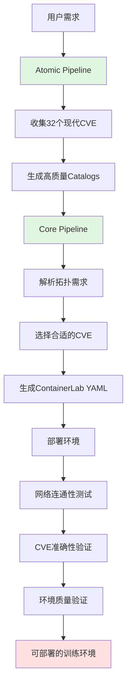

# ContainerLab Builder - 当前Pipeline架构

## 🎯 总体架构

项目当前包含**两个主要pipeline**，协同工作实现CVE训练数据的自动化生成：

```
用户需求 (拓扑YAML + CVE场景)
        ↓
    ┌───────────────────────┐
    │   1. Atomic Pipeline   │   CVE数据准备和catalog生成
    └───────────────────────┘
        ↓
    ┌───────────────────────┐
    │   2. Core Pipeline    │   环境生成、配置和验证
    └───────────────────────┘
        ↓
    可部署的训练环境 + 验证结果
```

---

## 📦 Pipeline 1: CVE原子化Pipeline

### 🎪 **目的**: CVE数据收集、处理和catalog生成

### 🏗️ **模块结构**: `src/clab_builder/atomic/`

#### 🔹 **1.1 数据收集阶段** (`processor.py`)
```python
CVEProcessor.process_from_vulnhub(vulnhub_url)
  ├─ 从VulnHub获取CVE README
  ├─ 提取CVE ID (CVE-YYYY-NNNN格式)
  ├─ 查询NVD数据库获取基础信息
  ├─ 提取环境信息 (Docker镜像、端口等)
  └─ 生成初始catalog数据
```

**输出**: 部分处理的catalog (YAML格式)

#### 🔹 **1.2 攻击阶段映射** (`mapper.py`)
```python
AttackStageMapper.map_from_description(description, cvss_vector)
  ├─ 关键词匹配 (12个MITRE ATT&CK阶段)
  ├─ 启发式规则分析
  ├─ CVSS向量解析
  └─ 攻击阶段评分和推理
```

**输出**: AttackChainFit对象 (包含primary_stage, stage_scores, reasoning)

#### 🔹 **1.3 信息丰富化** (`enricher.py`)
```python
CVEEnricher.enrich_attack_chain_analysis(catalog)
  ├─ 攻击时间线分析
  ├─ TTP (Tactics, Techniques, Procedures) 提取
  └─ IOC (Indicators of Compromise) 识别

CVEEnricher.enrich_topology_analysis(catalog)
  ├─ 网络层级适配分析
  └─ 依赖服务识别
```

**输出**: 丰富化的catalog数据

#### 🔹 **1.4 质量验证** (`validator.py`)
```python
CVEAtomicValidator.validate_catalog_syntax(catalog)
  ├─ 语法完整性检查
  └─ YAML格式验证

CVEAtomicValidator.validate_logic_consistency(catalog)
  ├─ 环境逻辑一致性
  └─ 攻击链连贯性检查

CVEQualityScorer.score_catalog(catalog)
  ├─ 完整性评分 (0-1)
  ├─ 准确性评分 (0-1)
  ├─ 可利用性评分 (0-1)
  └─ 总质量分数 (0-1)
```

**输出**: 验证通过 + 质量分数的catalog

#### 🔹 **1.5 Catalog存储** (`catalog.py`)
```python
数据结构:
- BasicInfo: CVE基础信息
- EnvironmentInfo: 环境需求 (Docker、端口、内存)
- AttackInfo: 攻击方法、复杂度、可用性
- AttackChainFit: MITRE ATT&CK阶段适配
- TopologyFit: 网络拓扑适配
- VerificationStatus: 测试状态记录
```

**存储位置**: `data/catalogs/verified/CVE-YYYY-NNNN.yaml`

### 📊 **当前状态**:
- ✅ **32个现代CVE catalog** (2018+)
- ✅ **平均质量分数**: 0.96
- ✅ **攻击阶段覆盖**:
  - initial_access: 13个 (41%)
  - execution: 12个 (38%)
  - privilege_escalation: 5个 (16%)
  - defense_evasion: 2个 (6%)

### 🛠️ **辅助工具**:
```bash
# 批量收集现代CVE
python scripts/collect_modern_cves.py

# 验证catalog质量
python scripts/validate_catalogs.py
```

---

## 🏗️ Pipeline 2: 核心环境生成Pipeline

### 🎪 **目的**: 从拓扑YAML生成可部署的ContainerLab环境

### 🏗️ **模块结构**: `src/clab_builder/core/`

#### 🔹 **2.1 拓扑解析** (`parser.py`)
```python
ContainerLabParser.parse_topology_file(yaml_file)
  ├─ 解析ContainerLab YAML格式
  ├─ 提取节点和链接信息
  ├─ 网络配置分析
  └─ 服务类型识别
```

**输出**: TopologyModel对象

#### 🔹 **2.2 拓扑生成** (`generator.py`)
```python
TopologyGenerator.generate_topology(cve_scenarios)
  ├─ 网络隔离配置 (YAML定义的安全区域)
  ├─ Iptables规则生成
  ├─ 路由表配置
  └─ DNS配置
```

**输出**: 完整的ContainerLab拓扑YAML

#### 🔹 **2.3 网络连通性测试** (`enhanced_connectivity.py`)
```python
EnhancedConnectivityTester.run_5_layer_test()
  ├─ Layer 1: ICMP ping测试 (丢包率、抖动、RTT)
  ├─ Layer 2: TCP/UDP端口连通性
  ├─ Layer 3: DNS解析验证
  ├─ Layer 4: 路由追踪 (跳数分析)
  └─ Layer 5: 性能测试 (iperf3 + ping回退)
```

**输出**: 网络健康评分 (0-100) + 详细报告

#### 🔹 **2.4 CVE准确性验证** (`cve_validator.py`)
```python
CVEAccuracyValidator.validate_cve_implementation()
  ├─ CVE ID有效性检查
  ├─ 版本准确性验证
  ├─ 漏洞存在性确认
  └─ 环境配置正确性

CVEExploitGenerator.generate_exploit_steps()
  ├─ 从catalog提取攻击步骤
  ├─ 生成验证playbook
  └─ 执行攻击验证
```

**输出**: CVE准确性报告 + 攻击验证结果

#### 🔹 **2.5 环境验证** (`validator.py`)
```python
EnvironmentValidator.validate_complete_environment()
  ├─ 部署状态检查
  ├─ 服务可用性验证
  ├─ 配置一致性检查
  └─ 整体环境质量评分
```

**输出**: 环境验证报告

---

## 🔄 两个Pipeline的协作流程

### 📋 **完整工作流程**:


### 🎯 **数据流**:
```yaml
输入:
  - 拓扑需求 (安全区域、节点类型、网络隔离)
  - CVE场景要求 (攻击阶段、复杂度、类型)

Atomic Pipeline处理:
  - 从32个catalog中选择合适的CVE
  - 验证MITRE ATT&CK阶段适配
  - 确保拓扑兼容性

Core Pipeline处理:
  - 生成ContainerLab拓扑
  - 配置网络隔离和路由
  - 部署和验证环境

输出:
  - 可部署的ContainerLab YAML
  - 完整的网络连通性报告
  - CVE准确性验证结果
  - 环境质量评分
```

---

## 📊 当前完成状态

### ✅ **已完成模块**:

#### Atomic Pipeline (100%完成):
- ✅ CVEProcessor: VulnHub数据处理
- ✅ AttackStageMapper: MITRE ATT&CK映射
- ✅ CVEEnricher: 信息丰富化
- ✅ CVEAtomicValidator: 质量验证
- ✅ CVECatalog: 数据结构定义
- ✅ 32个高质量catalog (平均0.96分)

#### Core Pipeline (100%完成):
- ✅ ContainerLabParser: YAML解析
- ✅ TopologyGenerator: 拓扑生成
- ✅ EnhancedConnectivityTester: 5层网络测试
- ✅ CVEAccuracyValidator: CVE验证
- ✅ EnvironmentValidator: 环境验证

### 🎯 **缺失的关键能力**:

#### ❌ **Batch Generation Engine** (待实现):
```python
# 需要的功能:
- CVE组合引擎: 根据攻击链组合多个CVE
- 批量拓扑生成: 一次生成多个训练场景
- 场景模板: 预定义的常见攻击场景
- 资源优化: 自动计算资源需求
```

#### ❌ **Agent Playbook Generation** (待实现):
```python
# 需要的功能:
- README解析Agent: 自动分析VulnHub文档
- 攻击执行Agent: 执行攻击并记录步骤
- Playbook提取Agent: 从执行过程生成playbook
- 结果验证Agent: 验证攻击成功率
```

---

## 🚀 下一步建议

### **优先级1: Batch Generation Engine**
**理由**: 为Agent提供基础架构，充分利用32个catalog

**实现要点**:
1. CVE组合算法 (基于攻击链兼容性)
2. 批量拓扑生成 (支持并行处理)
3. 场景质量评分 (确保可训练性)

### **优先级2: Agent Playbook Generation**
**理由**: 实现完全自动化的训练数据生成

**实现要点**:
1. AI驱动的文档解析
2. 自动化攻击执行和记录
3. Playbook模板生成
4. 成功率验证和优化

---

## 📈 项目成熟度评估

**整体进度**: 70%完成

- ✅ **数据基础**: 32个高质量catalog (100%)
- ✅ **Atomic Pipeline**: 完整实现 (100%)
- ✅ **Core Pipeline**: 完整实现 (100%)
- ❌ **Batch Generation**: 0% (待实现)
- ❌ **Agent System**: 0% (待实现)

**下一步目标**: 实现Batch Generation Engine，为Agent系统打下基础。