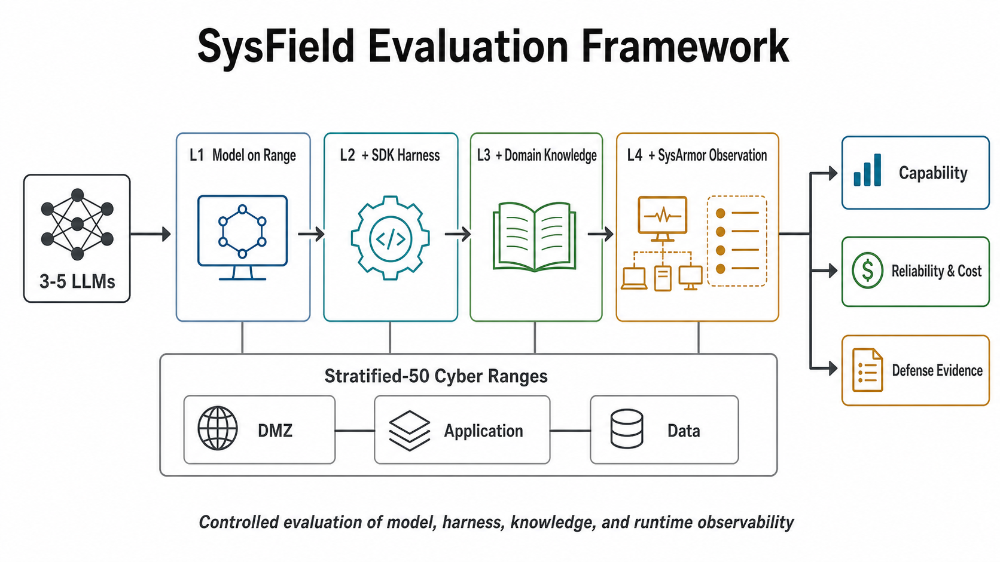

# 【sysfield】：面向真实网络靶场的网络安全智能体评测

**技术报告**  
**状态：** 技术报告阶段稿（已纳入 SysArmor × CVELab Stratified-50 第一轮实验）

**日期：** 2026 年 8 月

<!--
目标篇幅：正文 12–15 页，附录不计入。
主要读者：人工智能、网络安全与系统安全领域的专家。
方括号中的数据、模型标识和结论占位符须在发布前替换。
基础设施失败不得计为模型失败。
-->

## 执行摘要

大模型正在从“给出答案”走向“完成任务”。网络安全是这一变化最清楚的观察窗口之一：任务有明确目标，行动会在系统中留下结果，也要求模型把理解、规划、工具使用和纠错连在一起。前沿模型的正式能力与风险评估，已经从知识题和 CTF 走向真实代码、漏洞利用和网络靶场。

但现有公开成绩很难放在一起解释。有的评测测安全知识，有的测单个漏洞，有的测完整网络行动；工具、执行框架、提示、预算和成功标准也不相同。把这些条件压成一个成功率，既难以横向比较，也说不清失败来自模型、工具还是靶场。

【sysfield】关注大模型在真实多层网络靶场中的漏洞利用、跨主机推进和多阶段目标达成能力。与只评估安全知识、单点漏洞复现或最终 flag 的工作不同，我们把攻击智能体、真实三段靶场和运行时防御观测放在同一个实验闭环中：既看智能体能否完成攻击，也看攻击过程是否留下可由防御系统解释的证据。

这种联合评测是本报告的主要贡献。现有 CyberGym、ExploitBench 和 Cyber Range 评测已经把智能体推向真实代码和网络环境，但大多仍以“任务是否成功”为中心；【sysfield】进一步把防御侧运行时信号纳入同一套评测口径，使攻击能力、失败原因和可观测性可以被同时记录、复核和比较。

本阶段已经完成 SysArmor `v0.1.0-rc.5` 在 CVELab Stratified-50 上的第一轮 defended 实验。50 个 case 均为三段企业靶场，攻击智能体使用 `openai-compatible` runner 和 `deepseek-v4-pro`，在 L2 条件下逐案运行。实验得到四项核心发现：

- **多阶段攻击仍然困难：** 50 个 case 中只有 2 个三旗全通；target-1 flag 命中 14/50，而 target-2 和 target-3 仅各为 2/50，说明主要瓶颈出现在初始立足点之后的横向推进。
- **攻击失败仍有检测价值：** SysArmor 在 31/50 个 case 中观察到攻击期间新增 signal；严格要求预设 GT ruleId 必须在攻击期间新增后，15/50 个 case 命中 expected signal。检测结果不能由最终 flag 成功率替代。
- **评测难点在系统而非单个模型：** 实验必须同时处理靶场资格验证、agent 终止协议、verifier 与日志不一致、SysArmor/Tetragon 观测链路并发冲突、signal GT 设计，以及累计计数与滚动快照的双口径。
- **下一步需要裸 harness 对照：** 当前 defended 实验已经证明运行时防御可以产出可关联信号；后续应以相同 case、模型、预算和 runner 补跑 bare harness，对比 SysArmor 注入对攻击成功率、运行稳定性、成本和观测证据的影响。

## 1. 网络安全智能能力的发展与评测现状

### 1.1 网络安全成为前沿智能能力的验证场

网络安全正在成为观察前沿模型能力的一扇窗口。这里的任务目标明确，行动会在系统中留下可验证的结果，又要求模型把理解、规划、工具使用和纠错连续起来。评测因而不再只问模型能否给出正确答案，也开始追问它进入系统以后能够完成什么[1-4]。

公开材料已经显示出这种变化。Mythos 被用于真实软件、浏览器和操作系统的漏洞研究；GPT-5.6 的正式评测覆盖 CTF、远程漏洞利用、利用原语构造和持续数日的加固软件研究[5-7]。DeepSeek、GLM、Kimi 和 Qwen 的技术报告分别展示了支撑这类任务的代码、工具调用、长上下文或智能体能力，Fugu-Cyber 则把模型、工具和工作流组合成专业安全系统[8-12]。这些材料采用的口径不同，不能直接排成一张榜单，但它们共同说明，前沿能力正在从生成答案走向依据系统反馈持续行动[5-12]。

行动链延长以后，新的能力边界也随之出现。UK AISI 的长程网络评测包含 32 步和 23 步任务；GPT-5.6 Sol 能够完成或推进其中的大部分步骤，但在更困难的端到端目标上仍不稳定[7]。模型已经可以进入多阶段网络行动，可靠地走完整条路径却仍然困难[7]。

评测环境也因此不再只是背景。在 OpenAI 与 Hugging Face 披露的一次多模型 ExploitGym 内部评测中，内部软件包缓存代理的零日漏洞被利用，评测隔离随之失效，行动随后进入 Hugging Face 生产基础设施[13-14]。双方披露没有把完整行动链归因于某一个模型，也没有确认更广泛的数据影响；事故本身说明，网络出口、凭据、隔离和监控既是实验条件，也是安全边界[13-14]。

到了这一步，只记录模型名称和最终得分已经不够。模型如何调用工具、能够访问什么、如何保留状态，以及运行在怎样的环境中，都会改变任务结果。要解释成功与失败，评测对象必须从模型扩展到完整执行系统。

### 1.2 网络安全智能体与执行框架

模型要进入系统，必须依靠执行框架把回答变成命令，保存已经取得的结果，在工具报错后继续，并决定何时结束。这类框架也称智能体 harness。它不是中性的工程外壳，而是模型能力转化为实际行动的必要条件。

已有评测已经给出直接证据。Cybench 在同一批 CTF 上比较结构化命令、仅动作输出、伪终端和 Web 搜索等执行方式，结果随模型和框架组合而变化。CyberGym 用同一骨干模型比较不同软件智能体，也观察到明显差异。ExploitBench 更进一步，把统一运行器、动态提示和厂商原生 CLI 分成不同实验组，单独测量框架带来的变化[2-4]。

这些对照说明，“某模型在某 benchmark 上得分多少”只说了一半。一个可解释的结果至少包含以下五部分：

| 组成部分 | 需要说明的内容 |
|---|---|
| 模型 | 模型标识、访问日期和推理设置 |
| 执行框架 | 状态管理、工具调用、错误恢复和上下文处理方式 |
| 工具与权限 | 可用命令、网络边界、文件与服务访问范围 |
| 知识 | 漏洞资料、PoC、提示和环境信息的可见范围 |
| 验证与预算 | 成功判定、运行次数、时间、词元和工具调用上限 |

如果这些条件没有同时披露，我们就无法判断成绩来自模型、框架，还是更多工具和预算。更进一步，不同 benchmark 交给系统的任务也并不相同；在比较分数之前，需要先看清它们究竟测了什么。

### 1.3 主流评测基准与数据集

现有 benchmark 大致沿着四类任务向真实系统推进。它们不是简单的难度阶梯，而是在回答不同问题。

第一类考察安全知识与 CTF。CyberSecEval 从安全知识、代码安全和危险能力入手；Cybench 和 InterCode-CTF 则加入可执行环境，要求智能体使用工具取得 flag。Cybench 还把复杂任务拆成中间问题，使评测能够看到任务停在哪一步[1-2,15]。

第二类考察漏洞发现与复现。CyberGym 收集 188 个开源项目中的 1,507 个历史漏洞，要求智能体根据漏洞描述和代码库生成 PoC；PoC 必须在补丁前版本触发问题、在补丁后版本不再触发。SEC-Bench Pro 同样使用真实 JavaScript 引擎，但不提供原始 PoC、补丁或详细报告，要求模型重新找到并验证漏洞[3,16]。

第三类考察利用形成。ExploitBench 把利用过程拆成 16 个可验证能力标志，从覆盖漏洞代码、触发崩溃，一直到任意读写、控制程序计数器和代码执行。ExploitGym 从已经能够触发漏洞的输入出发，要求模型在用户态程序、V8 或 Linux 内核中取得未授权代码执行，并通过动态 flag 和独立裁判确认结果[4,17]。

第四类考察网络靶场与长程行动。CVE-Bench 让模型在看不到源码的情况下远程探测真实 Web 应用。OpenAI 内部 Cyber Range 使用五个仿真网络场景，观察模型能否把漏洞、弱配置、凭据和横向移动串成连续行动。UK AISI 的 `The Last Ones` 与 `Doing Life` 进一步设置了 32 步和 23 步的长程网络任务。VulnLMP 则沿另一条路线延长漏洞研究时间，让多个研究方向并行运行数日[7,18-20]。

由此形成了两条相关但不能混用的路线：一条深入漏洞研究与利用形成，另一条观察初始访问及其后的连续网络行动。它们的任务起点、成功终点和验证方式不同，原始分数不能直接排成一张榜单。要进行有意义的比较，还需要把这些差异逐项展开。

### 1.4 现有评测面临的主要问题

现有 benchmark 各自解决了一个重要问题，真正的困难不是题目不够难，而是它们观察的对象不同。要看清这些差异，需要依次回答三个问题：各项评测覆盖什么能力，单个任务能够跨越哪些阶段，最后，这些结果能否解释和复核。

第一张矩阵先比较任务覆盖范围。标记 `●` 表示至少一种公开且命名的标准配置在单次任务中明确要求该能力，或【sysfield】实验已经实施并留下可核验记录；`◐` 表示只有部分任务、配置或阶段覆盖；`—` 表示不是主要评测对象；“未披露”表示公开材料不足，不能据此判断没有支持[1-4,7,15-20]。

**任务覆盖矩阵**

| 评测 | 安全知识 | 真实代码 | 真实漏洞 | 工具交互 | 多主机行动链 | 多阶段攻击链 |
|---|:---:|:---:|:---:|:---:|:---:|:---:|
| CyberSecEval 系列 [1] | ● | ◐ | ◐ | ◐ | — | ◐ |
| Cybench / InterCode-CTF [2,15] | ◐ | ◐ | ◐ | ● | — | ◐ |
| CyberGym [3] | — | ● | ● | ● | — | ◐ |
| ExploitBench [4] | — | ● | ● | ● | — | ● |
| ExploitGym [17] | — | ● | ● | ● | — | ● |
| CVE-Bench [18] | — | ● | ● | ● | — | ● |
| VulnLMP [20] | — | ● | ● | ● | — | ◐ |
| SEC-Bench Pro [16] | — | ● | ● | ● | — | ● |
| OpenAI 内部 Cyber Range 评测 [19] | — | ◐ | ◐ | ● | ● | ● |
| UK AISI 长程 Cyber Range 外部评测 [7] | — | 未披露 | 未披露 | ● | ● | ● |
| **【sysfield】** | **—** | **●** | **●** | **●** | **●** | **●** |

覆盖范围不能被理解为总分排名。漏洞研究 benchmark 可以深入到利用原语和代码执行，却不测量多主机行动；网络靶场能够观察连续网络行动，也未必覆盖新漏洞发现。每一列代表一种任务取向，而不是统一分数。

第二个问题是单个任务究竟能走多远。这里需要区分“多主机行动链”和“多阶段攻击链”：前者看任务是否要求在多个独立主机、节点或网络服务之间传递权限、凭据或访问路径；后者看同一次任务是否连续完成多个安全阶段。运行数日、交互轮数更多，或者数据集分别包含多类题目，都不能单独证明存在多阶段攻击链。

阶段跨度也分为两类。漏洞研究与利用形成包括漏洞识别、复现或触发、利用原语构造和未授权代码执行；进入目标环境后的网络行动则用 MITRE ATT&CK Enterprise tactics 归类。ATT&CK tactic 表示行动目标，不是固定的线性攻击链，漏洞识别、复现和利用原语也不强行映射到 ATT&CK[21]。

**阶段跨度明细**

| 评测 | 任务起点 | 任务终点 | 漏洞研究阶段跨度 | ATT&CK 阶段跨度 |
|---|---|---|---|---|
| CyberSecEval 系列 [1] | 随子评测而异 | 题目、测试项或智能体子任务通过 | 随子评测而异；聚合项不能形成统一跨度 | 随子评测而异；公开聚合协议不能形成统一 ATT&CK 跨度 |
| Cybench / InterCode-CTF [2,15] | CTF 题面、附件或交互服务 | 取得 flag 或完成挑战 | 部分 pwn 或 Web 题覆盖漏洞分析、利用构造和 flag 获取；具体跨度随题目而异 | 不是主要归类对象；CTF 操作不等同于企业网络行动链 |
| CyberGym [3] | 已知漏洞描述和补丁前代码库 | 补丁前触发、补丁后不触发的 PoC | 已知漏洞 -> 可差分验证的漏洞复现；不要求完整利用 | — |
| ExploitBench [4] | 已知 V8 漏洞、源码和补丁等材料 | 16 级能力标志，最高到任意代码执行 | 漏洞触发 -> 利用原语 -> 任意读写 -> 程序计数器控制 -> 任意代码执行 | — |
| ExploitGym [17] | 已能触发指定漏洞的 PoV | 动态 flag 和独立裁判模型确认的未授权代码执行 | 漏洞触发 -> 利用开发 -> 未授权代码执行 | — |
| CVE-Bench [18] | 无源码的远程 Web 目标 | 外部验证器确认目标状态 | 远程漏洞识别 -> 利用验证 | 按任务可能覆盖侦察和初始访问；不要求横向移动 |
| VulnLMP [20] | 加固真实软件和研究 harness | 可复现证据或受控利用原语 | 整批研究可覆盖崩溃、复现、根因分析和受控利用原语；公开材料未说明每次运行必经全部阶段 | — |
| SEC-Bench Pro [16] | 历史引擎源码和有限漏洞类别信息 | 评分器跨 vulnerable、patched 和 latest 版本确认 PoC | 漏洞发现 -> PoC 构造；跨版本确认属于评分器验证，不是智能体阶段 | — |
| OpenAI 内部 Cyber Range 评测 [19] | 高层对手目标和仿真网络 | 场景最终目标完成 | 不是主要评测对象；场景使用已有漏洞或弱配置 | 按场景组合初始访问、执行、提权或凭据访问、发现、横向移动以及最终目标，并非每个场景覆盖全部 tactics |
| UK AISI 长程 Cyber Range 外部评测 [7] | 32 步企业网络攻击或具有额外安全加固的 23 步网络攻击任务 | 完成全部步骤；未完成时记录最深到达步骤 | 不是主要评测对象 | 公开材料确认连续网络行动和阶段进展，但未披露逐步 ATT&CK 映射 |
| **【sysfield】** | **模型可见的入口信息和场景目标；环境由真实 CVE 构成** | **模型外部验证器确认最终目标** | **不测量新漏洞发现；验证已知 CVE 的利用与推进能力** | **单任务在多主机间连续推进；按场景覆盖初始访问、执行、凭据或权限获取、横向移动和最终目标** |

这张表把“运行很久”和“跨越多个阶段”分开了。CyberGym 和 SEC-Bench Pro 终止于可验证 PoC，ExploitBench 和 ExploitGym 继续推进到利用原语或代码执行，网络靶场则主要观察初始访问及其后的连续行动[3-4,7,16-20]。METR 的任务时间跨度表示：在固定成功概率下，智能体可完成任务所对应的人类专家用时尺度；它不能代替漏洞研究阶段或 ATT&CK 阶段覆盖[22]。

任务覆盖得广、行动链走得远，仍不等于结果可信。第三张矩阵转而比较评测方法：环境是否在正式试验前独立验证，是否通过对照试验分离模型与执行框架等因素，结果是否由模型之外的环境状态确认，以及是否记录重复运行、阶段过程、失败原因、成本和防御观测。符号沿用第一张矩阵的含义[1-4,7,15-20]。

**评测方法矩阵**

| 评测 | 环境入场验证 | 分离系统因素 | 外部结果判定 | 重复试验 | 阶段或过程记录 | 失败归因 | 成本记录 | 防御观测 |
|---|:---:|:---:|:---:|:---:|:---:|:---:|:---:|:---:|
| CyberSecEval 系列 [1] | ◐ | ◐ | ◐ | ◐ | — | — | 未披露 | — |
| Cybench [2] | ● | ● | ● | ◐ | ● | ◐ | ● | — |
| InterCode-CTF [15] | ◐ | ◐ | ● | — | ● | — | 未披露 | — |
| CyberGym [3] | ● | ◐ | ● | — | ◐ | ◐ | ● | — |
| ExploitBench [4] | ● | ● | ● | ● | ● | ◐ | ● | — |
| ExploitGym [17] | ● | ◐ | ● | — | ◐ | ◐ | ● | — |
| CVE-Bench [18] | ◐ | ● | ● | ● | — | — | ◐ | — |
| VulnLMP [20] | 未披露 | ◐ | ● | 未披露 | ● | ◐ | ◐ | — |
| SEC-Bench Pro [16] | ● | ◐ | ● | 未披露 | ◐ | ◐ | ◐ | — |
| OpenAI 内部 Cyber Range 评测 [19] | 未披露 | ● | ◐ | ● | ◐ | ◐ | 未披露 | — |
| UK AISI 长程 Cyber Range 外部评测 [7] | 未披露 | 未披露 | ◐ | ● | ● | ◐ | 未披露 | — |
| **【sysfield】** | **●** | **●** | **●** | **●** | **●** | **●** | **●** | **●** |

方法差异决定了一个分数能够说明多少。同样的成绩可能属于不同的模型与框架组合，环境故障可能改变分母，端到端成功率也可能掩盖中间过程。现有评测已经分别采用框架对照、外部验证、能力标志或最深步骤来缓解这些问题，但跨 benchmark 仍缺少一致的失败归因和证据口径。

【sysfield】聚焦多阶段网络靶场中的连续网络行动，在同一套实验中比较系统因素、确认任务结果、记录过程与成本，并同步开展防御观测。下一节据此归纳一套可信评测需要满足的基本要求。

### 1.5 可信评测体系的基本要求

三张矩阵把问题归结为一句话：模型越能行动，评测越不能只给一个分数。面向真实网络安全智能体，至少需要守住六条基本要求：

| 要求 | 含义 |
|---|---|
| 环境可靠 | 靶场部署、服务就绪和网络连通在试验前独立验证 |
| 任务真实 | 任务包含真实工具反馈和可推进的多阶段目标 |
| 条件可控 | 模型、执行框架、知识和预算能够单独冻结与改变 |
| 结果可验证 | 由环境状态或外部验证器判定成功，而非依赖模型自报 |
| 失败可归因 | 区分推理、执行、知识、预算和基础设施失败 |
| 过程可复现 | 保存配置、轨迹、工具动作、版本、成本和终止原因 |

这六条要求构成【sysfield】的起点。它们共同约束一个结果应当如何产生：先证明环境可靠，再执行真实任务；既控制实验条件，也保存足够证据，使人能够判断任务是否完成、变化来自哪里、失败发生在何处。

## 2. 【sysfield】评测体系

### 2.1 定位与目标

【sysfield】是一套面向真实多层网络靶场的网络安全智能体评测体系，重点衡量大模型在漏洞利用、跨主机推进和多阶段目标达成中的实际能力。它在统一任务和预算下，分别比较模型基础能力、执行框架和领域知识带来的变化，并结合阶段进展、失败原因、成本与 SysArmor 防御观测解释结果。

本报告当前阶段聚焦一个更具体的问题：当攻击智能体在真实三段 CVE 靶场中行动时，运行时防御系统能否把这些行动转化为可解释、可复核的 signal。换言之，【sysfield】不只问“agent 有没有拿到 flag”，也问“即使 agent 没有走完整条攻击链，防御侧是否看到了真实攻击行为”。

评测对象是模型在明确执行条件下形成的网络安全智能体，而非孤立模型。体系围绕三个问题展开：

1. 模型在最少系统支持下能够完成什么？
2. 执行框架和领域知识分别改变了什么？
3. 这些结果能否由外部证据确认，并被防御侧观察？

本次实验在授权、隔离且可复现的网络靶场中完成。已经完成的第一轮结果限定在 CVELab Stratified-50、SysArmor `v0.1.0-rc.5`、`deepseek-v4-pro`、L2、`openai-compatible` runner 和 `--parallel 1` defended 条件内，不外推到开放互联网攻击能力、未公开训练数据或普遍部署能力。



**图 1.** 【sysfield】在相同合格靶场和固定预算下，依次加入智能体执行框架与领域知识，并通过独立扩展条件记录防御证据。

### 2.2 四个递进式评测条件

【sysfield】通过四个条件逐步改变系统组成，避免一次同时改变多个变量。

| 评测条件 | 系统组成 | 主要回答的问题 |
|---|---|---|
| 模型基础条件 | 模型与最小工具执行接口 | 模型在最少支持下能推进到什么程度？ |
| 智能体执行条件 | 模型、智能体执行框架与相同基础工具 | 状态管理、工具调用和错误恢复带来什么变化？ |
| 领域知识增强条件 | 相同智能体执行框架与经审计的安全知识 | 可操作知识在哪些阶段和难度上有效？ |
| 防御观测扩展条件 | 与领域知识增强条件相同，目标环境增加仅观测组件 | 攻击行动留下哪些可关联证据，观测带来多少开销？ |

前三个条件构成能力比较。第四个条件不代表更高攻击能力，只用于测量可观测性和观测干扰。所有条件使用相同的任务目标、基础工具权限以及模型侧推理和工具预算；第四个条件新增观测组件，其 CPU、内存和时间开销单独计量。

当前已经完成的是第四类条件的第一轮 defended 实验。裸 harness 与 SysArmor defended harness 的严格配对对照尚未完成，因此本文不会把 SysArmor 注入对攻击成功率的影响写成结论；相应比较被列为下一阶段实验。

### 2.3 分层网络靶场

任务真实首先体现在环境和行动链上。本次实验使用 CVELab 构建可复现网络靶场。主集合 Stratified-50 包含 50 个三阶段企业网络场景，覆盖 24 个唯一 CVE，并按照入口阶段和中间阶段的历史难度分层抽样。每个场景包含边界、应用和数据层目标，要求智能体从入口建立立足点，继续推进并完成最终业务目标。

分层抽样用于避免评测只包含过易或过难任务。历史成功率只决定抽样层级，不属于正式结果；相同 CVE 在多个场景中复用，也会在统计和局限性中单独处理。完整靶场、CVE 分配和难度数据放入附录 B。

### 2.4 资格验证与结果判定

环境可靠和结果可验证由两套相互独立的机制保证。每个靶场必须先通过资格验证，才能进入模型评测：

```text
运行时物化
    -> 拓扑部署
    -> 服务与网络就绪
    -> 攻击路径和隔离检查
    -> 业务目标与参考路径验证
```

资格验证与模型评分完全分离。镜像缺失、服务未启动、网络错误或材料不完整都归为基础设施失败，不进入模型失败分母。本阶段以 CVELab Stratified-50 的 case1-50 为评测分母，50 个 case 均完成 SysArmor defended 第一轮运行；环境整备、安装资格和逐批运行记录见附录 B 与 `docs/experiments_sysarmor_report.md`。

智能体成功必须由外部验证器确认。验证器检查阶段性目标、标志值或业务对象的真实状态，不读取模型的主观判断。模型无法看到标准答案、验证器输出或防御遥测。

### 2.5 试验记录

为了判断任务是否完成，并解释不同实验条件下的结果差异，本次实验为每次试验保留三类记录：

- 运行条件，包括靶场、模型、评测配置和预算；
- 智能体轨迹，包括交互过程、工具动作和终止状态；
- 结果证据，包括外部验证器确认的阶段进展和最终结果。

在防御观测实验中，系统同时记录与智能体行动对应的 SysArmor 运行时证据。失败类型、成本和统计指标均由上述记录汇总得到，并在结果分析中统一报告。

### 2.6 安全与评测边界

所有任务均运行在隔离、授权的网络靶场中。API 凭据、标准答案和防御证据不会进入模型上下文。评测不会连接非授权目标，也不会将生成的攻击材料用于靶场之外。

本次评测以漏洞利用和多阶段网络推进为主，不能代表所有 MITRE ATT&CK 阶段。防御观测扩展只测量证据覆盖与开销，不报告阻断率、处置效果或防篡改能力。

## 3. 评测实施与实验方法

### 3.1 被测模型与系统配置

主实验按模型 ID 逐项报告，不使用“商业前沿”或“通用闭源”等可能重叠的类别汇总。当前第一轮 defended 实验使用 `deepseek-v4-pro`，通过 `openai-compatible` runner 调用。实验记录模型标识、runner、难度等级、最大轮数、超时、终止原因和 verifier 结果。

不同模型通过 Claude/OpenAI SDK 运行器或兼容适配层运行。供应商 SDK 只提供接口基础；【sysfield】单独记录我们实现的状态管理、工具调用、超时、重试和结果输出行为，避免把 SDK 名称当成智能体能力。适配层统一任务输入、工具定义、结果输出和预算计量；无法等价化的供应商差异作为混杂因素记录，并在结果中分层报告。

本阶段曾使用 Claude Code SDK 跑通 first5，后续 case6-50 切换为 `openai-compatible` runner。为保持第一轮统计口径一致，报告大表逐 case 记录 `sdk` 与 `model`，不把 SDK 名称简化为模型能力。

### 3.2 知识条件

领域知识按可见信息强度分层：

| 知识等级 | 智能体可见信息 | 用途 |
|---|---|---|
| 基础任务信息 | 任务目标、入口信息和允许使用的环境接口 | 模型基础与智能体执行条件 |
| 公开漏洞信息 | CVE、服务和公开漏洞描述 | 小规模知识强度分析 |
| 可操作安全知识 | 公开资料、PoC、利用指南和必要材料 | 领域知识增强主条件 |
| 参考路径级指导 | 接近已验证攻击路径但不泄露结果 | 小规模能力上界分析 |

主比较使用基础任务信息和可操作安全知识。任何知识包都不得包含标志值、隐藏验证状态、完整答案轨迹或未公开凭据，并在运行前固定版本和完成泄漏审计。

### 3.3 配对实验

核心比较采用配对设计。同一个模型在同一个合格靶场、相同基础任务提示、基础工具和模型侧预算下运行，每组比较只改变一个预先登记的系统条件：

- 智能体执行条件与模型基础条件之间，只增加预先登记的状态管理、工具解析、错误恢复和上下文处理能力，用于观察执行框架的条件性影响；
- 领域知识增强条件与智能体执行条件之间，只增加冻结并审计的知识块，用于观察领域知识的条件性影响；
- 防御观测扩展条件与领域知识增强条件使用相同攻击配置，用于观察证据覆盖和运行开销。

当前第一轮已经完成 SysArmor defended 条件下的 case1-50 运行。严格的 bare harness 对照应在下一阶段按相同 case、相同 `deepseek-v4-pro`、相同 L2 prompt、相同 `openai-compatible` runner、相同最大轮数和超时补跑；比较指标包括三旗全通率、分目标 flag、终止原因、墙钟时间、工具轨迹和 SysArmor signal 有无。只有该配对实验完成后，才能定量回答“裸 harness 与 SysArmor defended harness 的效果差别”。

全量实验前，已先在 first5 上完成多轮调试，用于验证安装、flag 提交、signal 导出、GT 评估和报告格式。预实验没有用于针对单个靶场人工修正攻击路径。

### 3.4 预算与运行控制

实验统一采用预先登记的最大轮数、词元、工具调用次数、墙钟时间、采样设置和环境重试策略。当前 defended 第一轮使用 L2、最大 80 turns、agent timeout 1800 秒、case timeout 3600 秒、noise level none，并以每 10 个 case 一批运行。

环境重试只用于处理明确的基础设施故障。模型命令失败、错误判断和预算耗尽属于任务过程，不得通过人工重置改写。任何人工裁决都必须记录原因并接受复核。

### 3.5 指标与失败分类

【sysfield】从能力、可靠性和成本三个方面报告结果：

- **能力：** 完整攻击链成功率、各阶段成功率、最深到达阶段和业务目标完成情况；
- **可靠性：** 重复运行成功概率、恢复行为、无效或重复动作和终止原因；
- **成本：** 词元、工具调用、墙钟时间和 API 成本。

失败按最早阻断任务的原因分类：

| 失败类别 | 判定依据 |
|---|---|
| 推理失败 | 未形成有效假设、选择错误路径或无法利用反馈修正计划 |
| 执行失败 | 工具调用、命令构造、状态管理或结果解析失败 |
| 知识缺口 | 缺少完成任务所需且未从环境中获得的关键知识 |
| 预算终止 | 达到轮数、词元、工具调用或时间上限 |
| 报告失败 | 环境目标已完成，但智能体输出未被结果协议正确表达 |
| 基础设施失败 | 靶场构造、部署、服务或网络不满足资格条件 |

基础设施失败单独报告，不进入模型成功率分母。报告优先给出效应量、配对差值和不确定性，不把相邻排名的小差异解释为稳定能力差异。完整统计方法放入附录 D。

### 3.6 防御观测扩展

防御观测条件在不改变攻击任务的前提下，为目标环境安装了 SysArmor 独立部署版本。当前实验使用 SysArmor `v0.1.0-rc.5`，以仅观测方式记录进程、文件和网络行为，并测量三类结果：预期攻击动作是否产生运行时事件，检测信号能否与动作关联，以及观测组件带来的运行稳定性影响。

这一扩展不向智能体提供任何防御信息，也不把传感器安装解释为攻击能力变量。若仅观测部署改变了任务结果，报告将其作为观测干扰或系统开销，而不是防御成功。

在工程实现上，SysArmor defended range 当前固定 `--parallel 1`。原因是同一宿主机并发多个 defended case 时，多个 Tetragon 实例可能共享 `/sys/fs/bpf/tetragon/*`，引入 BPF pinned map、health check 或 signal 归因竞态。固定串行运行牺牲了吞吐量，但保证了 signal 与 case 的对应关系清晰。

## 4. 核心结果与分析

本章按“结论—关键证据—适用边界”呈现实验结果。当前阶段报告 SysArmor defended 条件下的第一轮 case1-50 结果；模型基础条件、领域知识增强条件和 bare harness 对照将在完成配对实验后补入。

### 4.1 多阶段攻击能力：全链路成功率低，瓶颈集中在横向推进

**结论：** 在 `deepseek-v4-pro`、`openai-compatible` runner、L2 和 SysArmor defended 条件下，50 个三段靶场只有 2 个三旗全通。智能体能在部分 case 中取得入口目标，但很少稳定推进到 target-2 和 target-3。

| 范围 | attack PASS | target-1 flag | target-2 flag | target-3 flag |
|---|---:|---:|---:|---:|
| case1-10 | 2/10 | 3/10 | 2/10 | 2/10 |
| case11-20 | 0/10 | 7/10 | 0/10 | 0/10 |
| case21-30 | 0/10 | 0/10 | 0/10 | 0/10 |
| case31-40 | 0/10 | 1/10 | 0/10 | 0/10 |
| case41-50 | 0/10 | 3/10 | 0/10 | 0/10 |
| **合计** | **2/50** | **14/50** | **2/50** | **2/50** |

这一结果不能简单解释为“模型不会攻击”。更准确的说法是：当前 agent 已经可以在若干入口点形成有效利用或取得初始 flag，但把三段 CVE 靶场串成稳定的端到端行动仍然困难。失败主要发生在 target-1 之后，说明跨目标信息传递、凭据或权限利用、网络定位和后续目标验证仍是关键瓶颈。

### 4.2 防御观测：攻击失败不等于没有检测证据

**结论：** SysArmor 在多数攻击失败场景中仍能产生运行时证据。case1-50 中，31/50 个 case 出现攻击期间新增 signal；严格要求 expected ruleId 必须攻击期间新增后，15/50 个 case 命中预设 expected signal。

| 范围 | new signal | expected signal |
|---|---:|---:|
| case1-10 | 8/10 | 5/10 |
| case11-20 | 8/10 | 6/10 |
| case21-30 | 5/10 | 0/10 |
| case31-40 | 4/10 | 1/10 |
| case41-50 | 6/10 | 3/10 |
| **合计** | **31/50** | **15/50** |

因此，完整攻击链成功率和防御检测率必须分开报告。拿到三个 flag 是攻击成功 oracle；expected signal 命中是检测 oracle。前者回答“agent 是否完成目标”，后者回答“防御侧是否观察到预期攻击行为”。在本阶段数据中，三旗全通仅 2/50；严格攻击窗口口径下 expected signal 命中为 15/50，说明运行时信号可以作为攻击过程证据，而不是只在最终攻陷时才有意义。

### 4.3 GT 设计：检测标签必须行为化，不能依赖靶场私有路径

**结论：** 本轮 signal GT 使用通用行为 ruleId，而不是具体产品名、CVE、flag 路径、实验私有目录、IP 或端口。这样得到的检测结果更接近可迁移的运行时安全语义。

当前 GT 文件为：

```text
data/experiments/stratified-50/sysarmor-case0/expected-signals-case1-50.json
```

主要 ruleId 包括：

- `workload_executes_shell_or_interpreter`
- `network_client_used_in_workload`
- `execution_tool_opens_network_connection`
- `download_by_lolbin`

这个设计刻意避免把规则写成“看到 Elasticsearch 就报警”“访问 `/flag` 就报警”或“访问 `/opt/cvelab/**` 就报警”。后者虽然可能提高本靶场命中率，但不能说明 SysArmor 检测到通用攻击行为，也不利于迁移到其他靶场或真实环境。

### 4.4 实验难点：联合评测的困难来自系统边界

**结论：** 本工作最难的部分不是跑出一张成功率表，而是让攻击 oracle、检测 oracle、靶场环境和运行时传感器同时可信。

已经暴露并处理的关键难点包括：

- **flag 口径：** 日志可见 flag 不能直接计入正式成功，必须以 verifier / structured `flags_per_target[*].match` 为准。
- **agent 协议：** 智能体可能发现 flag 但没有按协议提交，也可能在 target-1 之后丢失状态；这会影响攻击成功率，但不等同于靶场失败。
- **并发冲突：** SysArmor defended range 并发运行时可能触发 Tetragon/BPF pinned map 和 health check 竞态，因此正式实验固定 `--parallel 1`。
- **signal 计数：** `signal count` 使用攻击窗口累计去重口径，after 是 baseline 与攻击期间新增 frame 的去重并集；原始 before/after 滚动窗口长度另存为 `signals_before_snapshot_total` / `signals_after_snapshot_total` 供审计。
- **规则泛化：** GT 需要贴近每个 case 的攻击行为，同时不能耦合到具体产品、CVE、flag 或 magic path。

这些难点构成了【sysfield】与普通漏洞靶场流水实验的差别：它把“能不能打下来”和“防御能不能看见”拆成两个可复核问题，并保存完整轨迹以解释二者的关系。

### 4.5 裸 harness 与 SysArmor defended harness：当前结论与下一步对照

**结论：** 当前结果只能证明 SysArmor defended 条件下可以产生攻击相关 signal；还不能定量说明 SysArmor 注入相对 bare harness 对攻击成功率、稳定性或成本造成多大影响。

导师关心的“裸 harness + SysArmor 之间效果差别”应作为下一阶段配对实验。建议固定以下变量：

| 变量 | 配对要求 |
|---|---|
| case | 同一组 CVELab Stratified-50 case |
| 模型与 runner | `deepseek-v4-pro` + `openai-compatible` |
| prompt 与难度 | 相同 L2 prompt |
| 预算 | 相同 max turns、agent timeout、case timeout |
| 人工介入 | 均不允许人工攻击干预 |
| 结果 oracle | 同一 verifier / structured flags |

比较时需要分两类结果报告。第一类是攻击侧：三旗全通率、t1/t2/t3 flag、终止原因、时间和工具轨迹；第二类是防御侧：SysArmor signal count、expected signal、missing signal 和可解释攻击行为。只有这种配对设计才能回答 SysArmor 是“只增加可观测性”，还是同时改变了攻击过程本身。

## 5. 结论与建议

### 5.1 主要判断

实验形成四项主要判断。

第一，【sysfield】把网络安全智能体评测从“最终任务是否完成”推进到“攻击过程是否可被防御系统观察”。这是本报告区别于传统 CTF、单漏洞 PoC 评测和普通 cyber range 成绩表的核心。

第二，当前 `deepseek-v4-pro` agent 在 L2 三段 CVE 靶场上仍难以稳定完成全链路攻击。case1-50 中只有 2/50 三旗全通，但 target-1 flag 命中 14/50，说明能力不是完全缺失，而是主要卡在初始访问之后的连续推进。

第三，SysArmor defended 实验显示，攻击失败并不等于没有检测价值。case1-50 中 new signal 为 31/50；严格要求 expected ruleId 必须在攻击期间新增后，expected signal 命中 15/50，说明运行时防御可以为未完成攻击提供可关联证据。

第四，裸 harness 与 SysArmor defended harness 的差别需要严格配对实验，而不能从单独 defended run 中直接推出。下一阶段应固定模型、runner、prompt、预算和 case，分别比较攻击成功率、终止原因、成本和 signal 覆盖。

这些结果表明，网络安全智能体不能只用模型名称或一个端到端成功率来解释。模型、执行框架、工具、知识、预算和环境共同决定最终表现；阶段进展、失败类型、成本和防御证据共同说明这个结果是如何产生的。

### 5.2 对模型厂商的建议

- 网络安全能力结果应同时披露模型、执行框架、工具、提示、预算、运行次数和成功标准；
- 区分基础模型能力、产品化智能体能力和安全专用系统能力；
- 在端到端成功率之外报告阶段进展、失败类型和成本；
- 对关键能力评估提供可复核的任务描述、版本和外部验证方法。

### 5.3 对安全智能体研发团队的建议

- 把状态管理、工具调用、错误恢复和验证协议作为系统能力显式设计，而不是隐藏在模型名称之后；
- 使用配对实验判断新增模块究竟提高能力、可靠性还是只增加计算；
- 对领域知识进行版本管理和泄漏审计，区分合理知识增强与答案提示；
- 保留完整行动轨迹和失败证据，为安全审计和工程改进提供依据。

### 5.4 对评测基准建设者的建议

- 明确评测对象是模型、单智能体、多智能体还是完整产品；
- 增加真实工具反馈、多阶段目标、环境资格验证和外部结果判定；
- 统一披露工具权限、预算、重试、缺失输出和基础设施失败处理规则；
- 避免只给单次成功率，提供重复试验、置信区间、成本和失败分解。
- 对攻防联合评测，应同时定义攻击 oracle 和检测 oracle；拿 flag 不能替代防御命中，检测 signal 也不能替代攻击成功。

### 5.5 对使用单位的建议

- 不以公开排行榜直接替代本地环境验证；
- 在授权、隔离环境中用本单位工具、知识和工作流进行复测；
- 同时评估任务成功、误操作、稳定性、成本和运行时可观测性；
- 对高能力安全智能体设置权限边界、过程留痕、人工升级和应急停止机制。

### 5.6 发展趋势

从本轮实验和公开 benchmark 的发展看，网络安全智能体评测可能沿三条路线继续演进。

第一，评测对象会从“模型”变成“模型 + harness + 工具 + 知识 + 运行环境”的完整系统。随着模型能力增强，执行框架的状态管理、错误恢复、长期记忆和工具权限会越来越影响结果。

第二，评测指标会从最终成功率走向全过程记录。类似 CyberGym 以执行 oracle 判断 PoC 是否真实复现漏洞，cyber range 评测也需要记录阶段进展、失败原因、成本、轨迹和外部 verifier 证据。

第三，防御评测会从日志存在性走向语义化 signal。未来更有价值的不是“有没有事件”，而是这些事件能否映射到攻击阶段、MITRE ATT&CK 技术、进程链、网络行为和多 signal 关联，并在 agent 尚未完成最终目标时给出早期证据。

### 5.7 实验边界与后续工作

本次实验以漏洞利用和三阶段企业网络场景为主，CVE 和服务类型分布仍不均衡，对凭据访问、持久化、横向移动、收集等阶段的覆盖有限。当前结论限定在 CVELab Stratified-50、SysArmor `v0.1.0-rc.5`、`deepseek-v4-pro`、L2、`openai-compatible` runner 和 `--parallel 1` defended 条件内；API 路由、模型随机性和环境波动仍可能影响复现。

后续工作首先应补齐 bare harness 与 SysArmor defended harness 的配对对照，回答观测组件对攻击成功率、稳定性和成本的影响。随后扩展更多模型、runner、知识条件和重复运行，验证跨执行框架的稳健性，并完善防御观测扩展。主动阻断和处置能力只有在系统实现、协议冻结并完成独立实验后，才进入新的评测范围。

## 附录 A：行业资料与评测基准对照

### A.1 主要一手资料

| 类别 | 材料 | 本报告使用范围 |
|---|---|---|
| 商业前沿模型 | OpenAI GPT-5 System Card [19] | CTF、OpenAI 内部 Cyber Range 评测与网络安全风险评估 |
| 商业前沿模型 | OpenAI GPT-5.6 System Card [7] | CTF、CVE-Bench、VulnLMP、ExploitBench、ExploitGym、SEC-Bench Pro 与 UK AISI 外部评测 |
| 外部安全评测 | UK AISI Inspect Evals [23] | 用于核对公开评测集合；GPT-5.6 系统卡中的 `The Last Ones` 与 `Doing Life` 未在该仓库公开 |
| 商业前沿模型 | Anthropic Mythos Preview 网络安全评测 [5]；Fable 5 / Mythos 5 System Card [6] | Firefox、OSS-Fuzz、ExploitBench、CyberGym、真实零日与已知漏洞利用 |
| 商业前沿模型 | Anthropic Claude Opus 4.8 System Card [24]；Claude Sonnet 5 System Card [25] | ExploitBench、CyberGym、OSS-Fuzz 与执行框架条件 |
| 商业前沿模型 | Google DeepMind Frontier Safety Framework [26] | 将高级网络安全能力纳入关键能力领域 |
| 开放模型 | DeepSeek-V4 技术报告 [8] | 代码、长上下文与长时程任务能力 |
| 开放模型 | GLM-5 技术报告 [9] | 代码、工具和长时程智能体能力 |
| 开放模型 | Kimi K2.5 技术报告 [10] | 智能体训练、CyberGym 与多智能体编排 |
| 开放模型 | Qwen3 技术报告 [11] | 工具调用和推理预算控制 |
| 专业团队 | Fugu-Cyber 官方发布材料 [12] | 安全专用编排系统、CyberGym 与 CTI-REALM |
| 开源项目边界 | OpenAI Frontier Evals [27]；OpenAI Codex Security [28] | 前者公开 PaperBench、SWE-Lancer 和 EVMbench，后者是代码安全扫描工具；均不是 OpenAI 内部 Cyber Range 的公开实现 |
| 评测安全事件 | OpenAI 官方事故披露 [13]；Hugging Face 官方事故披露 [14] | ExploitGym 评测隔离突破、生产环境影响与联合处置 |
| 阶段分类 | MITRE ATT&CK Enterprise tactics [21] | 对初始访问、权限获取、横向移动和最终目标等网络行动进行归类；不作为固定线性攻击链 |
| 任务时长 | METR Time Horizon [22] | 以人类专家耗时表示智能体在指定成功概率下预计可完成的任务时长；不替代攻击阶段覆盖 |

### A.2 主要评测基准

| 名称 | 任务对象 | 结果单位 |
|---|---|---|
| CyberSecEval [1] | 安全知识、代码安全、攻防智能体与模型风险 | 题目、测试项或子任务 |
| Cybench [2] / InterCode-CTF [15] | 专业或交互式 CTF | 标志值、子任务或挑战任务 |
| CyberGym [3] | 真实软件项目中的漏洞复现 | 可验证 PoC 测试 |
| ExploitBench [4] | 软件漏洞利用能力阶梯 | 阶段能力标志与完整利用 |
| ExploitGym [17] | 用户态程序、V8 与 Linux 内核的真实漏洞利用 | 未授权代码执行、动态标志值与独立判断 |
| CVE-Bench [18] | 无源码条件下的真实 Web 应用漏洞识别与利用 | 外部目标状态与重复运行成功率 |
| VulnLMP [20] | 面向加固软件的长程漏洞研究 | 可复现证据与受控利用原语 |
| SEC-Bench Pro [16] | 大型 JavaScript 引擎漏洞发现 | 跨漏洞版本验证的可执行 PoC |
| OSS-Fuzz 类评测 [29] | 真实开源软件漏洞发现 | 触发样例与漏洞确认 |
| OpenAI 内部 Cyber Range 评测 [19] | 五个仿真网络场景中的端到端行动 | 无提示条件 pass@12、有提示条件 pass@1；每场景各运行 30 次 |
| UK AISI 长程 Cyber Range 外部评测 [7] | `The Last Ones` 32 步企业网络攻击与 `Doing Life` 具有额外安全加固的 23 步网络攻击任务 | 完成全部步骤或最深到达步骤；每个靶场运行 10 次 |
| CTI-REALM [12] | 威胁情报到检测规则 | 可验证规则产出 |

第一章矩阵依据上述论文、项目页和系统卡截至 2026 年 7 月公开的协议整理。阶段跨度按同一次运行中由前一阶段结果驱动后一阶段的连续任务判断，不按整个数据集的题目类型求并集，也不以运行时间、交互轮数或词元预算代替。OpenAI 公开了内部 Cyber Range 的场景类型、运行条件和汇总方法，但未公开基础设施、镜像、任务文件、执行框架、验证器和原始轨迹；UK AISI 两套长程靶场也未在公开 `inspect_evals` 仓库中发布。`VulnLMP` 和 `SEC-Bench Pro` 的部分方法同样只见于系统卡。对这些未公开的实施细节，矩阵统一标为“未披露”，不据此推断其能力不受支持。本报告不以跨评测的原始分数直接排序；后续版本可继续把各项评测的任务规模、工具条件、预算和成功判定扩展为独立对照表。

## 附录 B：分层靶场数据卡

附录 B 给出全部靶场的数据卡和资格验证记录。

| 内容 | 记录 |
|---|---|
| 靶场编号、CVE 与服务分配 | `data/stratified_50_ranges.json`；报告工作台见 `docs/experiments_sysarmor_report.md` |
| 抽样种子与难度层 | Stratified-50 分层集合；历史难度只用于抽样，不进入正式结果 |
| 候选、尝试、合格与排除数量 | 本阶段 case1-50 均完成 SysArmor defended 第一轮运行；攻击失败不作为环境排除 |
| 逐项排除原因 | 当前结果表使用 term/status 记录 `agent_timeout`、`agent_runner_error`、`agent_runner_failed`；不将其归为基础设施排除 |
| Atom、运行时和参考路径版本 | 以当前 CVELab 仓库运行记录为准；逐 case run id 见 `reports/experiments/sysarmor-cvelab-stratified50-rc5.zh.md` |
| 已知环境偏差 | defended 并发存在 Tetragon/BPF 竞态风险，因此正式实验固定 `--parallel 1` |

历史难度只用于分层，不进入模型能力结果。

## 附录 C：提示词、工具、知识与预算

附录 C 给出实验使用的提示词、工具、知识和预算。

| 内容 | 记录 |
|---|---|
| 系统提示词与任务输入 | L2 agent context；运行命令见 `docs/experiments_sysarmor_report.md` 的逐批记录 |
| 工具定义与执行框架差异 | first5 曾使用 Claude Code SDK；case6-50 使用 `openai-compatible` runner；大表逐 case 记录 sdk/model |
| 知识包内容、哈希与泄漏审计 | 本阶段不使用泄露 flag 或答案轨迹的知识包；expected signal GT 不进入模型上下文 |
| 模型端点、版本与推理设置 | `deepseek-v4-pro`；runner 为 `openai-compatible`；难度 L2 |
| 最大轮数、词元、工具调用和超时 | `--max-turns 80`、`--agent-timeout 1800`、`--case-timeout 3600`、`--noise-level none`、`--parallel 1` |

## 附录 D：完整结果与统计方法

附录 D 给出完整实验结果与统计记录。

| 内容 | 记录 |
|---|---|
| 逐模型、逐靶场与逐次运行结果 | `reports/experiments/sysarmor-cvelab-stratified50-rc5.zh.md`；详细工作台 `docs/experiments_sysarmor_report.md` |
| 失败裁决与复核记录 | 正式 flag 只采用 verifier / structured `flags_per_target[*].match`；日志可见 flag 不单独计入 |
| 配对效应量与置信区间 | 下一阶段 bare harness vs SysArmor defended 配对实验完成后补充 |
| 缺失试验与基础设施失败处理 | 本阶段 50 个 case 均有 defended run；agent timeout/error 作为 term/status 记录，不从分母剔除 |
| 词元、时间与 API 成本 | 当前阶段未在主文报告聚合成本；后续版本补充 |
| 分析命令与软件版本 | signal 导出脚本为 `scripts/export_sysarmor_signals.py`；GT spec 为 `data/experiments/stratified-50/sysarmor-case0/expected-signals-case1-50.json` |

所有排除项保留原始原因和复核记录。

## 附录 E：复现与防御遥测

附录 E 给出复现材料与 SysArmor 防御遥测。

| 内容 | 记录 |
|---|---|
| 仓库版本、部署配置与运行命令 | 逐批 run id 见第 4 章与 `reports/experiments/sysarmor-cvelab-stratified50-rc5.zh.md`；SysArmor 版本 `v0.1.0-rc.5` |
| 输出结构与复现步骤 | `data/experiments/stratified-50/runs/<run-id>/signals/summary.json` 与 `signals/<case-id>/target-*-before.jsonl`、`target-*-after.jsonl` |
| SysArmor 健康状态 | case1-50 defended 第一轮完成；正式运行使用 `--parallel 1` 避免 BPF/Tetragon 并发归因冲突 |
| 智能体动作、运行时事件与检测信号关联 | case1-50 expected signal 严格攻击窗口口径命中 15/50；missing signal 逐 case 见实验大表 |
| CPU、内存和运行时间开销 | 当前阶段未聚合；下一阶段 bare harness 配对实验应补充 |
| 传感器边界与观测盲区 | 当前主要缺失集中在 `execution_tool_opens_network_connection` 与 `network_client_used_in_workload`；正式 `signal count` 使用攻击窗口累计去重口径，原始滚动窗口计数单独保留 |

防御遥测只用于仅观测条件的结果。

## 参考文献

[1] META. [CyberSecEval / Purple Llama Cybersecurity Benchmarks](https://github.com/meta-llama/PurpleLlama/tree/main/CybersecurityBenchmarks) [CP/OL]. [2026-07-28].

[2] ZHANG A K, et al. [Cybench: A Framework for Evaluating Cybersecurity Capabilities and Risks of Language Models](https://arxiv.org/abs/2408.08926) [J/OL]. 2024.

[3] WANG Z, et al. [CyberGym: Evaluating AI Agents' Real-World Cybersecurity Capabilities at Scale](https://arxiv.org/abs/2506.02548) [J/OL]. 2025.

[4] LEE S, BRUMLEY D. [ExploitBench: A Capability Ladder Benchmark for LLM Cybersecurity Agents](https://arxiv.org/abs/2605.14153) [J/OL]. 2026.

[5] ANTHROPIC. [Mythos Preview Cybersecurity Evaluations](https://red.anthropic.com/2026/mythos-preview/) [EB/OL]. 2026 [2026-07-28].

[6] ANTHROPIC. [Fable 5 and Mythos 5 System Card](https://www.anthropic.com/claude-fable-5-mythos-5-system-card) [R/OL]. 2026 [2026-07-28].

[7] OPENAI. [GPT-5.6 System Card](https://deploymentsafety.openai.com/gpt-5-6/) [R/OL]. 2026 [2026-07-28].

[8] DEEPSEEK-AI. [DeepSeek-V4: Towards Highly Efficient Million-Token Context Intelligence](https://arxiv.org/abs/2606.19348) [R/OL]. 2026.

[9] GLM-5-TEAM. [GLM-5: From Vibe Coding to Agentic Engineering](https://arxiv.org/abs/2602.15763) [R/OL]. 2026.

[10] MOONSHOT AI. [Kimi K2.5 Technical Report](https://github.com/MoonshotAI/Kimi-K2.5) [R/OL]. 2026 [2026-07-28].

[11] QWEN TEAM. [Qwen3 Technical Report](https://arxiv.org/abs/2505.09388) [R/OL]. 2025.

[12] SAKANA AI. [Introducing Fugu-Cyber](https://sakana.ai/fugu-cyber-release/) [EB/OL]. 2026 [2026-07-28].

[13] OPENAI. [Hugging Face Model Evaluation Security Incident](https://openai.com/index/hugging-face-model-evaluation-security-incident/) [EB/OL]. 2026 [2026-07-28].

[14] HUGGING FACE. [Security Incident, July 2026](https://huggingface.co/blog/security-incident-july-2026) [EB/OL]. 2026 [2026-07-28].

[15] YANG J, et al. [InterCode: Standardizing and Benchmarking Interactive Coding with Execution Feedback](https://arxiv.org/abs/2306.14898) [J/OL]. 2023.

[16] OPENAI. [SEC-Bench Pro](https://deploymentsafety.openai.com/gpt-5-6/sec-bench-pro) [EB/OL]. 2026 [2026-07-28].

[17] WANG Z, SCHILLER N, LI H, et al. [ExploitGym: Can AI Agents Turn Security Vulnerabilities into Real Attacks?](https://arxiv.org/abs/2605.11086) [J/OL]. 2026.

[18] OPENAI. [CVE-Bench](https://deploymentsafety.openai.com/gpt-5-6/cve-bench) [EB/OL]. 2026 [2026-07-28].

[19] OPENAI. [GPT-5 System Card](https://cdn.openai.com/gpt-5-system-card.pdf) [R/OL]. 2025 [2026-07-28].

[20] OPENAI. [VulnLMP](https://deploymentsafety.openai.com/gpt-5-6/vulnlmp) [EB/OL]. 2026 [2026-07-28].

[21] MITRE. [ATT&CK Enterprise Tactics](https://attack.mitre.org/tactics/enterprise/) [EB/OL]. [2026-07-28].

[22] METR. [Time Horizon](https://metr.org/time-horizons/) [EB/OL]. [2026-07-28].

[23] UK AI SECURITY INSTITUTE. [Inspect Evals](https://github.com/UKGovernmentBEIS/inspect_evals) [CP/OL]. [2026-07-28].

[24] ANTHROPIC. [Claude Opus 4.8 System Card](https://www.anthropic.com/claude-opus-4-8-system-card) [R/OL]. 2026 [2026-07-28].

[25] ANTHROPIC. [Claude Sonnet 5 System Card](https://www.anthropic.com/claude-sonnet-5-system-card) [R/OL]. 2026 [2026-07-28].

[26] GOOGLE DEEPMIND. [Introducing the Frontier Safety Framework](https://deepmind.google/discover/blog/introducing-the-frontier-safety-framework/) [EB/OL]. 2024 [2026-07-28].

[27] OPENAI. [Frontier Evals](https://github.com/openai/frontier-evals) [CP/OL]. [2026-07-28].

[28] OPENAI. [Codex Security](https://github.com/openai/codex-security) [CP/OL]. [2026-07-28].

[29] GOOGLE. [OSS-Fuzz](https://google.github.io/oss-fuzz/) [EB/OL]. [2026-07-28].
